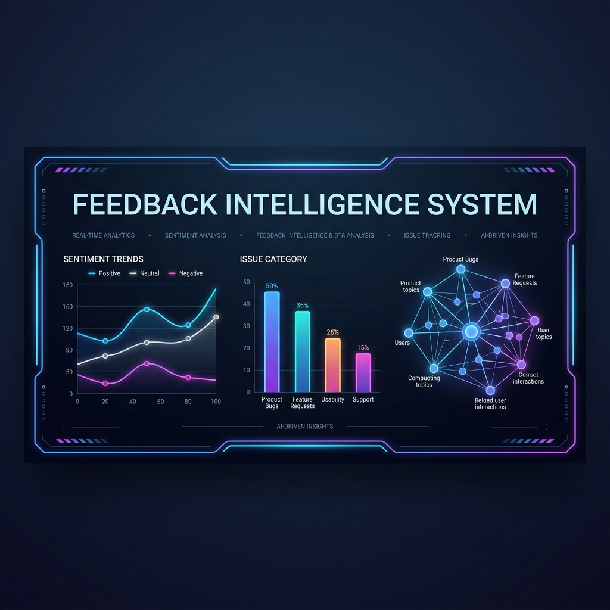

# 📊 Multi-Source Feedback Intelligence System

<div align="center">



[](https://python.org)
[](https://streamlit.io)
[](https://neo4j.com)
[](https://docker.com)
[](https://opensource.org/licenses/MIT)

</div>

---

## 📖 Project Overview

The **Feedback Intelligence System** is a next-generation analytics engine that harvests online reviews, processes them through an offline sentiment classifier and categorization parser, and persists them into a local SQL or live **Neo4j Graph Database**. It generates stakeholder-ready weekly analytics reports in PDF format and presents real-time trends in an interactive dashboard.

---

## ☁️ Deployment

Streamlit is a stateful Python framework that requires a persistent socket server process. Serverless hosting platforms like **Vercel** are designed for static sites and short-lived execution limits (which terminate background socket connections).

To host this application online, use **Streamlit Community Cloud** (which is the official, free hosting platform for Streamlit apps, linking directly from GitHub in 1 click):

[](https://share.streamlit.io/deploy?repository=PiyushTiwari2051/Feedback-Intelligence-System&branch=main&mainModule=src/dashboard/app.py)

### 3-Step Public Deployment Guide:
1. Click the **Deploy to Streamlit** badge above.
2. Sign in with GitHub, select your repository name, and set the Main file path to: `src/dashboard/app.py`.
3. In the Advanced Settings panel, paste your environment configurations (e.g. `GROQ_API_KEY`, `NEO4J_URI`, etc.) and click **Deploy**. Your dashboard goes live instantly!

---

## ⚡ Live Terminal Pipeline Mockup
Here is what the real-time ingestion log output looks like when you trigger the Play Store scraper:

```bash
[SYSTEM] Starting Ingestion Cycle for App ID: com.whatsapp
[INGEST] Fetched 50 raw reviews from Google Play Store.
[PIPE]   cleaner.py ──► Strip HTML: Done (50/50)
[PIPE]   sentiment.py ──► VADER Polarity: Positive (32), Neutral (12), Negative (6)
[PIPE]   categorizer.py ──► Keyword Rules: Bug (22), Crash (8), Support (6), Pricing (4), Other (10)
[DB]     db.py ──► Connected to Neo4j Graph DB on bolt://host.docker.internal:7687
[DB]     db.py ──► Created Graph Nodes and [:FROM_SOURCE] + [:HAS_CATEGORY] relationships.
[PRIO]   priority.py ──► Recalculated weights. Crash category escalated to 🔥 HIGH Priority.
[SYSTEM] Ingestion Cycle Complete. Dashboard refreshed.
```

---

## 🗺️ Graph Modeling Architecture

When **Neo4j Graph Database Mode** is active, reviews are modeled as interconnected graph nodes. This allows you to trace correlations between issues, platforms, and category clusters:

```
                      (s:Source {name: "google_play"})
                                     ▲
                                     │ [:FROM_SOURCE]
                                     │
                             (r:Review {id})
                                     │
                                     │ [:HAS_CATEGORY]
                                     ▼
                      (c:Category {name: "Crash"})
```

<details>
<summary><b>🔍 Click here to view the Cypher Insertion Query</b></summary>

```cypher
UNWIND $batch AS row
MERGE (s:Source {name: row.source})
MERGE (c:Category {name: row.category})
MERGE (r:Review {id: row.id})
SET r.text = row.text,
    r.rating = row.rating,
    r.date = row.date,
    r.sentiment_label = row.sentiment_label,
    r.sentiment_score = row.sentiment_score,
    r.priority_score = row.priority_score
MERGE (r)-[:FROM_SOURCE]->(s)
MERGE (r)-[:HAS_CATEGORY]->(c)
```
</details>

---

## ⚙️ Database Storage Toggles

The application dynamically toggles storage backends based on your environment configurations:

| Database Mode | Active Credentials in `.env` | Primary Use Case |
| :--- | :--- | :--- |
| **Local SQLite** | None (Leave blank) | Offline development, zero setup, local database file |
| **Neo4j Graph** | `NEO4J_URI`, `NEO4J_USERNAME`, `NEO4J_PASSWORD` | Cloud/local deployment, visual graph relationships, advanced analytics |

<details>
<summary><b>🛠️ Step-by-Step Neo4j Configuration</b></summary>

1. Ensure your Neo4j instance is running (e.g. your active `caios-neo4j` docker container).
2. Open the Neo4j Browser at `http://localhost:7474`.
3. Open your `.env` file in the project root and fill in your connection details:
   ```env
   NEO4J_URI=bolt://host.docker.internal:7687
   NEO4J_USERNAME=neo4j
   NEO4J_PASSWORD=your_neo4j_password_here
   ```
   *(We use `host.docker.internal` so the dashboard container can communicate with the Neo4j instance running on your host machine.)*
4. Restart your docker containers or the streamlit server. The system will detect the config and boot up in Graph mode automatically.
</details>

---

## 🚀 Running the Project

### Method A: Docker Compose (Recommended)
Build and run the entire application container stack in detached mode:
```bash
docker-compose up -d --build
```
Open **[http://localhost:8501](http://localhost:8501)** in your browser.

*To stop the app containers, run:* `docker-compose down`

### Method B: Local Python Development
1. Navigate to the project root directory:
   ```bash
   cd feedback_intelligence
   ```
2. Activate virtual environment:
   ```bash
   # Windows
   .\venv\Scripts\Activate.ps1
   ```
3. Run the Streamlit server:
   ```bash
   streamlit run src/dashboard/app.py
   ```

---

## 📐 Priority Scoring & Automation

The engine runs a mathematical algorithm to score issue categories:

$$\text{Priority Score} = \text{Category Frequency} \times \text{Average Negativity}$$

*   **Average Negativity**: Calculated as the absolute VADER compound score for negative reviews. Positive/Neutral reviews contribute `0.0`.

### 🚨 Automation Escalation Rules
*   **Zero-Tolerance Crashes**: Any category classified as `Crash` containing $\ge 1$ negative review is auto-escalated to 🔥 **HIGH Priority**.
*   **Bug Thresholds**: `Bug` categories with a priority score $\ge 1.5$ are auto-escalated to 🔥 **HIGH Priority**.
*   **Volume Thresholds**: Any category with a score $\ge 3.0$ is escalated to 🔥 **HIGH Priority**.

---

## 🧪 Running Unit Tests

We have written 19 logic unit tests covering all text cleaning, sentiment calculations, and priority scoring functions. To execute the tests, run:

```bash
.\venv\Scripts\Activate.ps1
pytest tests/
```

Expected Output:
```text
tests\test_categorizer.py ......                                         [ 31%]
tests\test_cleaner.py .....                                              [ 57%]
tests\test_priority.py ....                                              [ 78%]
tests\test_sentiment.py ....                                             [100%]

============================= 19 passed in 0.46s ==============================
```

---

## 📂 Directory Layout

```
feedback_intelligence/
├── src/
│   ├── ingestion/          # Play Store & App Store RSS Harvesters
│   │   ├── google_play.py
│   │   ├── app_store.py
│   │   └── csv_loader.py
│   ├── processing/         # Cleaning & classification
│   │   ├── cleaner.py
│   │   ├── sentiment.py
│   │   └── categorizer.py
│   ├── intelligence/       # Trends & Priority Matrix
│   │   ├── trend.py
│   │   └── priority.py
│   ├── storage/            # SQLite & Neo4j Toggle Engine
│   │   └── db.py
│   ├── reporting/          # Stakeholder Report Generator (PDF)
│   │   └── pdf_report.py
│   └── dashboard/          # Streamlit UI App
│       └── app.py
├── tests/                 # Unit tests
│   ├── test_cleaner.py
│   ├── test_sentiment.py
│   ├── test_categorizer.py
│   └── test_priority.py
├── data/                  # Local SQLite storage directory
├── Dockerfile             # Container configuration
├── docker-compose.yml     # Compose file orchestrating services
├── requirements.txt        # Pinned packages
└── README.md              # Detailed guide
```
