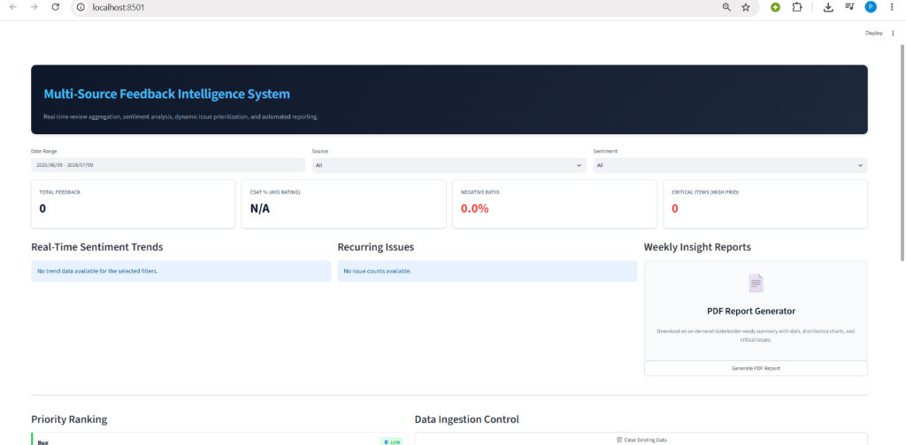
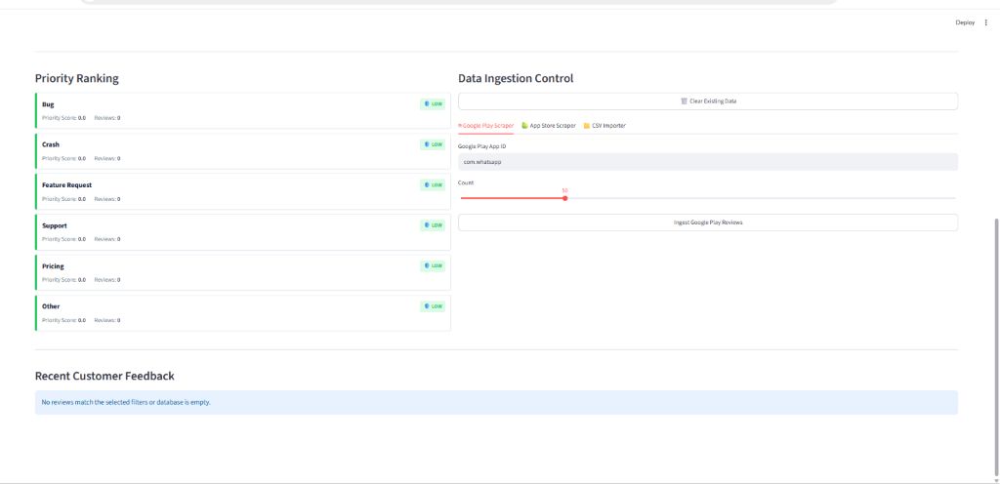

# Feedback Intelligence System

The Feedback Intelligence System is a modular Python application designed to collect, clean, categorize, and prioritize customer reviews from Google Play Store, Apple App Store RSS feeds, and CSV uploads. 

The application utilizes offline NLTK VADER sentiment analysis, keyword rules, and an optional LLM-fallback classifier to route and analyze reviews. Stored feedback can be dynamically queried on an interactive Streamlit dashboard or exported as a PDF report.

---

## Key Features

*   **Multi-Channel Ingestion**: Live review scraping for Google Play Store and iOS App Store, plus custom CSV uploading.
*   **Rule-Based & AI Processing**: Fast keyword-based categorization with automatic fallback to Groq Llama 3 for ambiguous reviews.
*   **Graph & Relational Storage**: Dual-database support. Connects to a cloud/local Neo4j Graph database, or defaults to a local SQLite file out-of-the-box.
*   **Dynamic Prioritization**: Ranks issue categories based on the product formula: `Frequency × Average Negativity`. Crash issues auto-escalate to High priority.
*   **Automated PDF Reporting**: Generates summaries, metrics tables, and distribution charts to export for stakeholders.

---

## System Architecture

```
[Google Play]     [App Store RSS]     [CSV Upload]
      │                  │                 │
      └──────────────────┼─────────────────┘
                         ▼
             [Ingestion & Normalization]
                         │
                         ▼
             [Text Cleaning (cleaner.py)]
                         │
                         ▼
             [Sentiment Analysis (VADER)]
                         │
                         ▼
             [Categorization (Rules/LLM)]
                         │
            ┌────────────┴────────────┐
            ▼                         ▼
      [SQLite DB]                [Neo4j Graph]
      (Local Mode)               (Cloud Mode)
```

In **Neo4j Graph Mode**, feedback data is mapped as nodes and relationships:
*   `(:Review)` nodes contain text, rating, dates, and sentiment labels.
*   `(:Source)` nodes represent the origin of the review.
*   `(:Category)` nodes represent the issue classification.
*   Relationships: `(:Review)-[:FROM_SOURCE]->(:Source)` and `(:Review)-[:HAS_CATEGORY]->(:Category)`.

---

## 📊 Dashboard Visuals

Below is what the live, responsive Streamlit dashboard looks like when running on your local machine:

### 1. Metrics & Analytical Visualization Charts
Displays the summary cards, the date/platform filters, the real-time sentiment timeline chart, and the issue category distribution graph.


### 2. Priority matrix & Ingestion Control Panel
Displays the dynamic severity priority lists, the scraping controls (Google Play, App Store, CSV), and the scrollable recent customer reviews table.


---

## 🔑 API & Credentials Setup

The system integrates AI-assisted categorization using the **Groq Cloud API** (running Llama 3 8B model).

### Setting Up Groq LLM Fallback (Llama 3)
1. Go to **[Groq Developer Console](https://console.groq.com/)** and create a free account.
2. Navigate to **API Keys** and generate a new key.
3. Open your `.env` file in the project root and paste the key:
   ```env
   GROQ_API_KEY=gsk_your_groq_api_key_here
   ```
4. **Behavior**: If a review doesn't match any keyword rules, the system queries Groq to classify it. If `GROQ_API_KEY` is left blank, the app runs offline and defaults the category to `"Other"`.

## Database Configuration

The storage backend toggles dynamically depending on your environment file configuration:

### 1. SQLite Relational Mode (Default)
If no graph database credentials are found in your `.env` file, the application defaults to local Relational Mode and initializes `data/feedback.db`.

### 2. Neo4j Graph Mode
To write directly to your Neo4j instance, define the following variables in your `.env` file:
```env
NEO4J_URI=bolt://host.docker.internal:7687
NEO4J_USERNAME=neo4j
NEO4J_PASSWORD=your_neo4j_password
```
*(If running Streamlit via Docker, use `host.docker.internal` as the URI host to resolve ports on your host computer).*

Before running, execute these constraints in your Neo4j Browser (`http://localhost:7474`) to optimize query speeds:
```cypher
CREATE CONSTRAINT review_id IF NOT EXISTS FOR (r:Review) REQUIRE r.id IS UNIQUE;
CREATE CONSTRAINT source_name IF NOT EXISTS FOR (s:Source) REQUIRE s.name IS UNIQUE;
CREATE CONSTRAINT category_name IF NOT EXISTS FOR (c:Category) REQUIRE c.name IS UNIQUE;
```

---

## Setup & Execution

### Method A: Docker Compose (Recommended)
1. Copy `.env.example` to `.env` and fill in your custom keys (if any).
2. Start the container stack:
   ```bash
   docker-compose up -d --build
   ```
3. Open **[http://localhost:8501](http://localhost:8501)** in your browser.

### Method B: Local Environment
1. Create and activate a Python virtual environment:
   ```bash
   python -m venv venv
   # Windows activation:
   .\venv\Scripts\activate
   ```
2. Install dependencies:
   ```bash
   pip install -r requirements.txt
   ```
3. Run the Streamlit server:
   ```bash
   streamlit run src/dashboard/app.py
   ```

---

## Deployment

Streamlit runs a stateful WebSocket server to sync user interactions. Standard serverless hosting like Vercel terminates these long-running background connections, causing Streamlit to fail.

To host the application online, deploy it using the official, free **Streamlit Community Cloud** linked directly to your GitHub repository:

[](https://share.streamlit.io/deploy?repository=PiyushTiwari2051/Feedback-Intelligence-System&branch=main&mainModule=src/dashboard/app.py)

1. Click the badge above to open the deploy interface.
2. Set the repository to: `PiyushTiwari2051/Feedback-Intelligence-System`.
3. Set the Main file path to: `src/dashboard/app.py`.
4. Add your environment variables (like `GROQ_API_KEY`, `NEO4J_URI`, etc.) in the Advanced Settings panel.
5. Click **Deploy**.

---

## Running Unit Tests
To run the automated pytest suite:
```bash
pytest tests/
```
